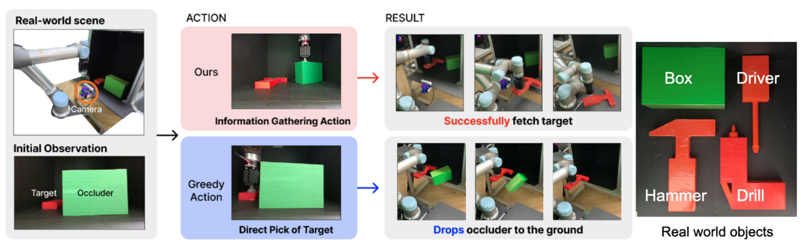

# Preference Learning for Guiding the tree searches in continuous POMDPs

Accepted at CoRL 2023

[[Paper]](https://openreview.net/pdf?id=09UL1dCqf2n)
[[Project page]](https://sites.google.com/view/preference-guided-pomcpow?usp=sharing)
[[Github]](https://github.com/iMSquared/PGP)
[[SlideShare]](https://www.slideshare.net/JisuHan19/preference-learning-for-guiding-the-tree-searches-in-continuous-pomdps-corl-2023)

We take inspiration from the recent work in learning to guide task and motion planning to propose a framework that learns to guide POMCPOW from past planning experience. Our method uses prefer-
ence learning that utilizes both success and failure trajectories, where the preference label is given by the results of the tree search. We demonstrate the efficacy of our framework in several continuous partially observable robotics domains, including real-world manipulation, where our framework explicitly reasons about the uncertainty in off-the-shelf segmentation and pose estimation algorithms. 



## Code details
We implement on two following domains: (1) Light Dark domain and (2) object fetching domain. Check out `toy_domain` and `Simulation` folder, respectively.

## Cite this work
```
@inproceedings{ahn2023preference,
  title={Preference learning for guiding the tree search in continuous POMDPs},
  author={Ahn, Jiyong and Son, Sanghyeon and Lee, Dongryung and Han, Jisu and Son, Dongwon and Kim, Beomjoon},
  booktitle={Conference on Robot Learning},
  pages={3929--3948},
  year={2023},
  organization={PMLR}
}
```